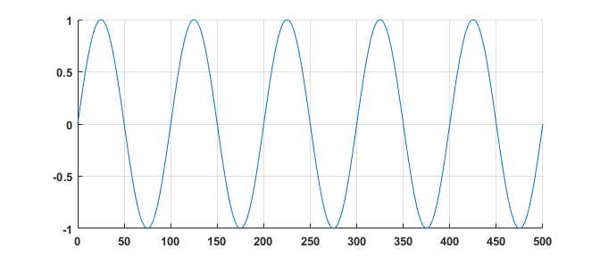
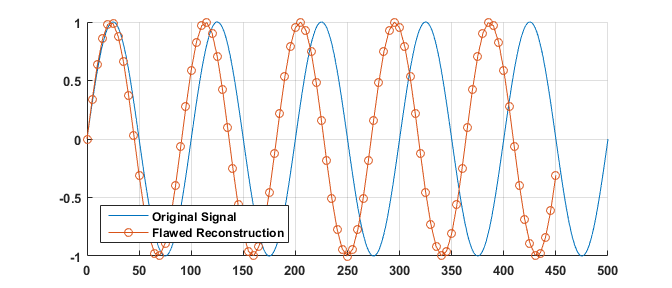
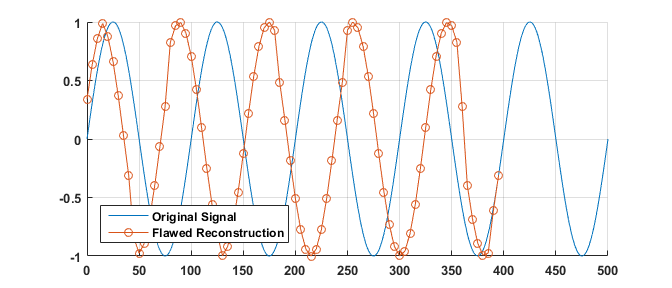
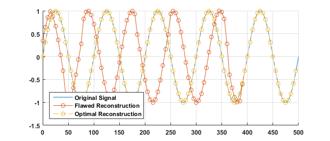

# Signal Reconstruction by Time Stamp
Data logging applications are easy to code though unfortunately they are also one of the easiest programs to mess up. Small sampling error can accumulate and destroy the accuracy of estimation. Consequently, one must take due diligence in the collection of data as well as the as the reconstruction. Consequently, the following is my recommendation for data collection and reconstruction in the case. 

## Sinewave sampling example

Consider the following continous sinewave with a period of 125 seconds. In the continous time domain, this would look like the following: 

<p align='center'>

</p>

Now consider a sample rate of 5 seconds but samples are really being collected every 5.5seconds. If this data were to be plotted with the assumption of a 5s sampling interval, here would be the result: 

<p align='center'>

</p>

Furthermore, consider the common case where data reception has a 10% chance of failure or being missed. 

<p align='center'>

</p>

Finally, consider the case where the original samples were timestamped. With a timestamp, one can reconstruct the original signal in an optimal fasion. In matlab, this can be done with the **interp1** command. For example:

```matlab
yEstimated = interp1(timeStamps,yValuesRecorded,desiredTimeStamps,'spline');
```

With interpolation, many sampling errors such as missing samples and inconsistent sampling intervals can be accounted for.

<p align='center'>

</p>

As observed, error due to inconsistent sampling period as well as the missing data was significantly reduced. Data interpolation by timestamp is a key pre-processing step that must be applied before estimation. This also illustrates the why it is crucial to provide time stamps with data as opposed to relying on the assumption that the data was recorded consistently. 
