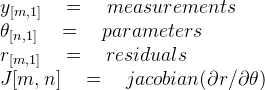
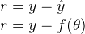
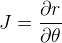
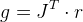
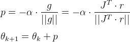
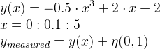
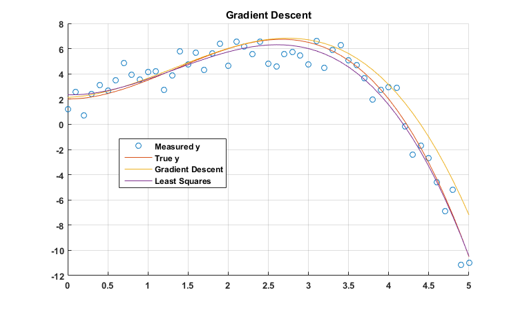

<p align="center"> <a href="../readme.md"><b>Back To Index</b></a></p>

## Gradient Descent Tutorial 

### Background: 

Should you have the unfortunate ignorance to have interest in an unstable, suboptimal, and computationally expensive algorithm called gradient descent, then this tutorial is for you. The list of better choices is nearly endless but this primitive algorithm has gained unfortunate popularity due to it being introduced in some popular introductory 'machine learning' courses. What you are probably intrested in is an algorithm called 'Least Squares' but none the less I have introduced that which is most shit, gradient descent, below:  

### Method:

Firstly, the notation to be used is shown below as well as their respective dimensions:  

<p align="center">

</p>

This assumes **_m_** number of data samples has been collected and that the model has **_n_** number of parameters. **_y_** represents the output data that has been measured. **_theta_** is the matrix of model parameters that are to be estimated. **_r_** is residual matrix that is also named the error or the innovation matrix. 

#### Step 1: Calculate r

In optimization, the residual vector is the vector of errors. It is the difference between the observed data and the predicted data. **_yHat_** is our predicted data or our model output.

<p align="center">

</p>

Our model output is some function of **_theta_** .

#### Step 2: Calculate the Jacobian .

The Jacobian is the partial derivative of residual vector with respect to the model parameters. 

<p align="center">

</p>

If the Jacobian is independent of model parameters, this is a linear convex optimization problem. There will be a global optimal solution and the Jacobian matrix is constant. 

#### Step 3: Calculate the gradient. 

Next we calculate the gradient of the residual function with respect to the model parameters. 

<p align="center">

</p>

#### Step 4: Calculate the next theta.
Gradient descent requires an initial guess of **_theta_**. From there, **_theta_** is updated each iteration. The idea is to approximate the slope(gradient) of the residual function **_r_** and travel some fixed step size in the direction of the gradient. Steps are often notated in optimization as **_p_**. Here our step then is the normalized gradient multiplied by the step size **_alpha_**.

<p align="center">

</p>

This is then calculated iteratively and **_theta_** is recalculated each step: 

 ```matlab 
iterations = 10000; % Fixed iteration length 
alpha = 0.01; % Step length
for i = 2:iterations; 
    r = yMeasured - (-J*theta(:,i-1)); % Calculate residual 
    theta(:,i) = theta(:,i-1) - alpha * (J')*r/ norm((J')*r); % Update Theta
end
 ```
Note the above is for a linear convex estimation problem. In such a problem **_f(theta) = -J*theta_**. 

#### Limitations: 

An initial guess of **_theta_** must be provided to the algorithm. The convergence of the algorithm is dependent on how far off the initial guess is with respect to the step length **_alpha_**. Consequently, to use this algorithm in practice, the initial guess and **_alpha_** must be manually tunned until convergence is observed. Naturally this is a significant drawback of the algorithm. Also, if step length is too small, the algorithm may not converge in our life time or it may run into numerical issues. 

#### Convergence:

One item not covered yet is convergence. One method is simply to run for a fixed number of iterations and hope for the best. A slightly better method is to set a maximum iteration limit but stop if convergence is observed. Gradient descent should converge quadratically if at all. Consequently, 


## Example:

Consider the following cubic model that is sampled for x values between 0 and 5 in 0.1 increments.The measured model as normally distributed noise of 0.1 added to it.  

<p align="center">

</p>

The following is a basic Matlab/Octive Gradient descent algorithm: 

```matlab 
function theta = gradDescent(J,y,theta,alpha,itLimit)
for i = 1:itLimit; 
    r = y - (-J*theta); % Calculate residual 
    theta = theta - alpha * (J')*r/ norm((J')*r); % Update Theta
end
end
```

Using this basic algorithm operating on this data one may observe a plot similar to the following:

<p align="center">

</p>

Note here a comparison was made versus least squares. Least squares will always produce a more optimal result and potentially do so in a less computational manner. Furthermore, least squares is guaranteed to converge where as gradient descent depends on step size selection and iteration limits.  

Here is the code which generated the above plot: 

```matlab 
x = (0:0.1:5)';
y = -0.5*x.^3+2*x.^2+2;
noise = randn(length(x),1);
yMeasured = noise + y;
iterations = 100000; % Fixed iteration length 

J = -1.*[x.^3,x.^2,x.^1,x.^0];
theta = zeros(size(J,2),1);

alpha = 0.05; % Step length

theta = gradDescent(J,yMeasured,theta,alpha,iterations);
thetaLSQ = -1*pinv((J')*J)*(J')*yMeasured;

fig1 = figure(1);
clf(fig1);
hold on
scatter(x,yMeasured);
plot(x,y)
plot(x,(-J)*theta)
plot(x,(-J)*thetaLSQ)
grid on
set(gca,'FontSize',10,'FontWeight','bold');
set(gcf,'Units','Pixels');
set(gcf, 'Position', [2500, 500, 750, 450]);
legend('Measured y', 'True y','Gradient Descent','Least Squares')
title('Gradient Descent')

```

<p align="center"> <a href="../readme.md"><b>Back To Index</b></a></p>