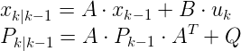
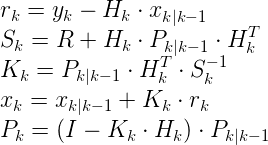
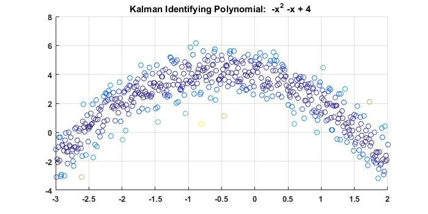
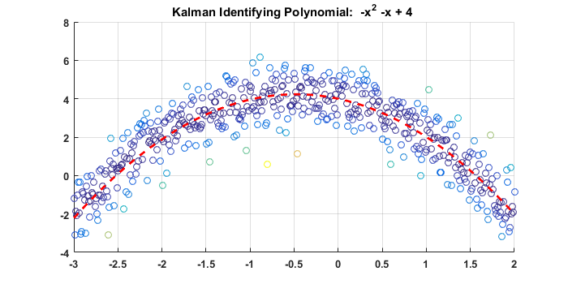
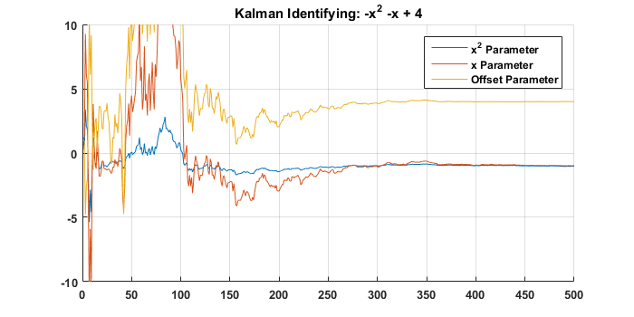

<p align="center"> <a href="../readme.md"><b>Back To Index</b></a></p>

# Kalman Filter Estimation

### Introduction: 

The Kalman filter is a recursive stochastic state estimation filter that is optimal for minimizing MSE. Further theoretical discussion on the topic would be a disservice to the thousands of others that have undoubtedly already done a better job describing it. Regardless, unique examples provide engineers with intuition regarding the kalman filter's application and can further their intuition regarding the filter itself. Consequently, these examples will demonstrate how to use the kalman filter to estimate. 

| Notation  | Name  | Description |  Alternate Notations | 
|----|----|----|----|
| x | State Variables | These are the states one uses a kalman filter to identify | | 
| A | State Matrix | This matrix shows the update transition of the state for each step absent of an input | F | 
| B | Input Matrix | This matrix relates inputs to state updates | 
| H | Observation Matrix | This matrix relates measurements to states  | C, J |
| Q | Process Noise Covariance | This matrix reflects the noise of the model(proccess). Low variance implies high accuracy of the model |  
| R | Measurement Noise Covariance | This matrix reflects the noise of the measurements. Low variance implies high accuracy of the measurement |
| P | State Covariance | This sample covariance matrix will show the covariance of the states | 
| y | Measurements | This scalar or vector represents the physical measurements from the system  | z | 

Unfortunately, RLS, Kalman, and numerous other algorithms have their own unique notations for the same concepts. The above notation is more reflective of optimization and traditional controls state space. The following is the kalman filter algorithm: 

### Kalman Filter Algorithm: 

#### Step 1: Predict

<p align="center">

</p>

#### Step 2: Update

<p align="center">

</p>

#### Code: 

```matlab
% NZ 
function [x,P] = kalman(x,y,u,A,B,H,Q,R,P)

%% Predict
xHat = A * x + B * u;
Ph = A * P * (A') + Q;

%% Update 
r = y - H * x; 
S = R + H * P * (H');
K = P * (H') * inv(S);
x = xHat + K*r; 
P = (eye(length(x)) - K * H) * Ph; 

end
```

## Example 1: 

Sooner then getting bogged down in the details of the filter, an example of using the filter for estimation will be presented. Consider the following example of a polynomial with noise. We can use a kalman filter to identify the coefficients of this polynomial.  

<p align="center">

</p>

### Step 0: Generate or acquire data
The kalman filter is a recursive filter and is meant to be used for data acquired on the fly. Least squares estimation is more optimal for offline identification. Anyhow, for the sake of this example, the data will be generated beforehand and normally distributed noise will be applied: 

```matlab
x = (-3:0.01:2)'; % This is the time samples 
y = -x.^2 - 1*x + 4 ; % This is the true model
noise = 1*randn(length(x),1); % Noise model 
yMeasured = y + noise; % This is the measurement.
```

### Step 1: Formulate A & B

The first step is to formulate **A**, the state transition matrix. In this case of using a kalman filter for identification, the **A** matrix is simply equal to the identity matrix since we do not expect our parameters to change from step to step. In theory, the model is constant. The next step is to select **B**, the input matrix. In this case we have no input to our system. One could attempt to feed time through B but this would further complicate the polynomial identification. 

```matlab
A = eye(3);
B = zeros(3,1);
```
### Step 2: Select Q & R.  

**R** is the measurement noise matrix. In this case we only have one measurement and as a result, this is simply the variance of our measurement. This can be easily selected from experimental data. In this case it is assumed to be one. ** Q ** is the process noise covariance matrix. **Q** is a measure of how much we expect the model to vary. In this case, were trying to fit the data to our model so we infer absolute confidence in the model by setting the variance of our model to extremely small.  

```matlab
Q = eye(3) * 1e-5;
R = 1;
```

### Step 3: Select H   

Now to be honest, this is a basic example but an akward example for the kalman filter. The kalman filter is most easily applied to identify states such as velocity, acceleration and other derivative related terms. The kalman filter is often also used to fuse data from multiple sources related by derivatives such as an acceleromter and gryoscope. The kalman filter is primarily designed for [time invariant](https://en.wikipedia.org/wiki/Time-invariant_system) systems where as this example is a polynomial is based on time.
However, we somehow need to feed in the jacobian of the system which is [x^2,x,1]. We can do this by using the observation matrix. 

```matlab
H = [x.^2,x.^1,x.^0]; % Formulate Jacobian 
```

Again, this is abnormal because generally H is constant. In a LTI system, H will be constant. However, since we are not changing A or B based on time, our optimization is still convex. 

### Step 4: Select P & Xi   

P, the state covariance matrix, ideally should be initalized to a large value such that the filter can move quickly at the start. An initial P matrix of low magnitude will take longer to converge from a poor initial guess. An initial guess of the states must be made. This can simply be 0s for each state. However, ideally, for quicker convergence, one should try to formulate a best guess of the system. 

```matlab
X = zeros(3,length(x)+1); % This creates an array of the solution per each iteration.
X(:,1) = [1;1;1]; % Assign our initial guess 
H = [x.^2,x.^1,x.^0]; % Formulate Jacobian 
```

### Step 5: Apply the filter to the data

```matlab
for i = 1:length(x)
    [X(:,i+1), P] = kalman(X(:,i),yMeasured(i),0,A,B,H(i,:),Q,R,P);
end
```

### Results: 

The results of the Kalman identification can be seen below:

<p align="center">

</p>

Here are the convergence of the parameters: 

<p align="center">

</p>


### Example 1 Code: 

```matlab
%NZ

x = (-3:0.01:2)'; % This is the time samples 
y = -x.^2 - 1*x + 4 ; % This is the true model
noise = 1*randn(length(x),1); % Noise model 
yMeasured = y + noise; % This is the measurement. 

X = zeros(3,length(x)+1); % This creates an array of the solution per each iteration.
X(:,1) = [1;1;1]; % Assign our initial guess 
H = [x.^2,x.^1,x.^0]; % Formulate Jacobian 

P = 1e3 * eye(length(theta)); % Init covarience matrix 
lambda = 1; % No forgetting factor 

A = eye(3);
B = zeros(3,1);

Q = eye(3) * 1e-5;
R = 1;


for i = 1:length(x)
    [X(:,i+1), P] = kalman(X(:,i),yMeasured(i),0,A,B,H(i,:),Q,R,P);
end

yCalculated = H*X(:,end); % Our predicted model

%% Below Code is to make a pretty plot 

fig = figure(1); % Make a figure
clf(fig) % Erase figure
hold on % Hold plot
error = (yMeasured - y).^2; % Error
scatter(x,yMeasured,[],error); % Plot measured data 
plot(x, yCalculated ,'r--','LineWidth',2) % Plot Results
grid on
title('Kalman Identifying Polynomial:  -x^2 -x + 4 ')
set(gca,'FontSize',10,'FontWeight','bold');
set(gcf,'Units','Pixels');
set(gcf, 'Position', [2500, 500, 700, 350]);

fig3 = figure(3);
clf(fig3);
hold on 
title('Kalman Identifying: -x^2 -x + 4')
plot(X(1,:))
plot(X(2,:))
plot(X(3,:))
legend('x^2 Parameter','x Parameter','Offset Parameter')
xlim([0,500])
ylim([-10,10])
grid on
set(gca,'FontSize',10,'FontWeight','bold');
set(gcf,'Units','Pixels');
```

<p align="center"> <a href="../readme.md"><b>Back To Index</b></a></p>