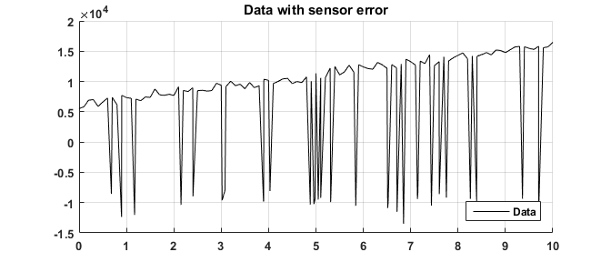

# Majority Non-linear Least Squares 

<p align=center>
</img>
</p>

Majority least squares is a simple and robust outlier rejection method for least squares problems. Inevitably in practice, outliers and anomalies exist that corrupt data and the subsequent models. It follows that intrinsic outlier rejection is recommended  for unsupervised learning systems to function in practice. Majority least squares achieves this by looking at the majority of data as opposed to data in its eternity. This is advantageous over other robust techniques since no weighting is given to outliers. However, it operates on the following assumption: 

- The majority of data is 'good' data with a normal/uniform distribution of error.

#### Example problem: 

Consider a failing sensor where roughly 20% of the data readings are faulty. The desired model is an optimal line agnostic of the failures. In this hypothetical case, the sensor itself is un-aware of these faults. 

<p align=center>
</img>
</p>

To combat such an issue, naturally the best solution is to fix the sensor itself. Other sub-optimal strategies may include low pass filtering, Kalman filtering, anti spike filtering...ect. All of these solutions require for-knowledge of the problem and are only useful in hindsight. An alternate solution is to have a robust solver that intrinsically rejects outliers.  

<p align=center>
</img>
</p>

Most optimizers optimize to the mathematical optimal which is the L2 norm. Unfortunately this is heavily biased by outliers. This is observed in the above plot as the blue *LSQ* trace. To counter-act this, *robust least squares* is often implemented which modifies the traditional cost function to reduce the penalty of outliers. An example 'robust' cost function is an approximation of the L1(median/abs) norm which is often more optimal in the presence of outliers. However, such functions are still in part biased by outliers as shown above. In contrast, Majority Least Squares provides 0 weight to outliers and detects outliers through the percentile of residuals. Performance of the algorithms is listed in the table below for the above example: 


| Algorithm | Slope | Slope Error | Offset | Offset Error |   
| ----- | ----- | ---- | ----- | ---- | 
| Reference | 1000 | n/a |  6000 | n/a 
| LSQ | 1203.5 | 20.3 % | 491.1 | 91.8 %
| RLS | 1230.4 | 23.0 % |3051.2 | 49.1 %  
| MLS | 994.2 | 0.6 %  |  5952.9 | 0.8 % | 

The above table is purely for reference and could have been skewed to nearly any extreme to illustrate any arbitrary point. For example, the more extreme the outlier, the more LSQ & RLS error would have increased. Conversely, small outliers would have resulted in RLS & LSQ having negligible differences in contrast to MLS. MLS hence finds its value in the nature of the outliers.   

#### Implementation: 

The following will overview how to implement majority least squares. Majority least squares introduces a parameter, **σ** , which is the percentage of data to use in optimization. Residuals that are beyond this percentage are dropped. This algorithm is implemented within the NLSQ / damped least squares context and utilizes the following concepts:


- Use least squares to derive a starting point for the algorithm 
- Iteratively resolve the LSQ problem by adjusting a step, **p**, based upon dropping data beyond the **σ** percentile. 
- Use a damping parameter, **λ** , that is heuristically calculated to ensure beneficial steps of **p** and to help ensure stability.
- Use a diagonal weight matrix, **W**, to reject dropped points within the solver. 

The following is matlab code which implements the above concepts. 

#### MLS.m

```matlab
% Majority Least Squares |  Nathan Zimmerman 7/7/2018
% theta --> Output Parameters 
% J --> System Matrix(A) or Jacobian(J)
% y --> Data Observations 
% dp --> Data Percentage to use. Recommended: 0.7 (70%)
function theta = MLS(J,y,dp)
lamda = 1; % Damping Parameter 
rn = floor(length(y)*dp)+1; % Rejection number  
theta = pinv((J')*J)*(J')*y; % LSQ initial estimate 
r = y - J*theta; % Calculate initial residual vector 
rSort = sort(r.^2); % Sort residual vector 
W = diag(r.^2<rSort(rn)); % Create weight matrix
oldCost = norm(W*r); % Calculate initial cost, remove outliers  

for i =1:20; % For a fixed iteration
    r = y - J*theta; % Calc residual 
    rSort = sort(r.^2);
    W = diag(r.^2<rSort(rn)); % Create weight matrix 
    JNew = -W*J; % Eliminate outliers 
    p = -pinv(JNew'*JNew + lamda*eye(length(theta)))*JNew'*r; % Calc step
    newCost = norm(W*(y - J*(theta+p))); % Calc new cost
    if(newCost<oldCost) % Is step an improvement? 
        theta = theta+p;  
        oldCost = newCost;
        lamda =0.1*lamda; % Yes? Apply step, decrease damping 
    else
        lamda = 10*lamda; % No? Increase damping 
    end
end
end
```

Naturally, improvements could be made to the above but this hopefully communicates the basic idea of the algorithm. In my humble opinion, its quite simple to implement while potentially being more effective than many robust algorithms. It has the capacity to completely reject multi-modal problems again assuming the majority of data is 'good'. Biggest hit to the efficiency of this algorithm is in the sorting of the residual vector. In most cases, such a sort would not be castrophic. 

#### Adaption for Majority Non-linear Least Squares 

With relatively little effort, the above code can be adapted for Majority Non-linear Least Squares. NLSQ is already required to implement MLS. Instead of directly operating on a provided **J**, the Jacobian matrix can be estimated from an arbitrary residual function. In this case, our non-linear optimization problem can be written as a residual function and passed to the optimizer. 

##### Residual Function format:

<p align="center">
<i>r(x,y,θ) = y - function(x,θ)</i> 
</p>

Where the ***function*** is whatever arbitrary function which is to be optimized, where ***θ*** are the optimization parameters, where ***x*** are the function inputs, and where ***y*** are the observed measurements.   

The following is a demonstration of MNLSQ on a cosine of unknown amplitude, phase, and offset where a biased signal is injected on top of the desired signal.


<p align=center>
</img>
</p>

Naturally, NLSQ is ill-suited for biased outliers where as MNLSQ is robust against biased outliers assuming it does not represent the majority of the data. 


#### MNLSQ.m

```matlab
% Majority Non-linear Least Squares |  Nathan Zimmerman 9/16/2018
% theta --> Output Parameters 
% r --> residual function 
% x --> Input array
% y --> Data Observations 
% dp --> Data Percentage to use. Recommended: 0.7 (70%)
function theta = MNLSQ(x,y,fnc,params,dp)

alpha = 1;
theta = params;
dn = floor(length(x)*dp);
rOld = fnc(x,y,theta);
rOldS = sort(rOld.^2);
rReduce = rOld(rOld.^2<rOldS(dn));
oldCost = norm(rReduce);

for i =1:100;
    r = fnc(x,y,theta);
    rSort = sort(r.^2);
    W = diag(r.^2<rSort(dn)); 
    J = W*jacY(x,y,fnc,theta);
    p = -pinv(J'*J + alpha*eye(length(params)))*J'*r;
    newCost = norm(W*fnc(x,y,theta+p));
    if(newCost<oldCost)
        theta = theta+p;  
        oldCost = newCost;
        alpha =0.1*alpha;
    else
        alpha = 10*alpha;
    end
end
end

```
