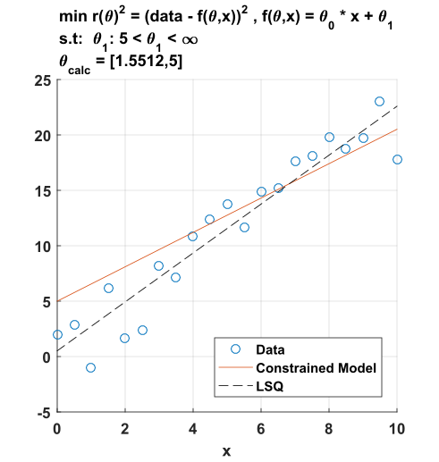
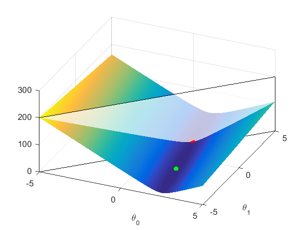
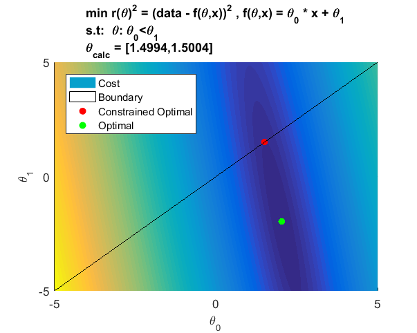

<p align="center"> <a href="../readme.md"><b>Back To Index</b></a></p>

# NLSQ with Constraints 

**Introduction:** While standard Non-Linear Least Squares(NLSQ) is an unconstrained optimization technique, many real world problems often are subject to constraints. For example, physical systems such as vehicles, robots, actuators, and sensors often have physical limits. To address this, numerous algorithms and techniques have been developed to implement various constraints. This write-up explores some basic NLSQ constraint techniques. While these methods are neither optimally efficient nor optimally robust, they are a starting point for intuition regarding constraint implementation.   


## NLSQ Review: 

NLSQ attempts to minimize squared error of an objective function. 

<p align ='center'>
    
<p>

Where: 

<p align = "center">
    <i>r(θ)</i> : Non linear objective error function <br>
    <i>θ</i> : Optimization parameters
</p>

This problem can be solved via a multitude of methods though my favorite is simple method called **[LMA](https://en.wikipedia.org/wiki/Levenberg%E2%80%93Marquardt_algorithm)** which is essentially damped least squares. The following is simple octave/matlab code to implement this approach: 

```matlab
function theta = lma(Rfnc,params,iterations)

alpha = 1;
theta = params;
oldCost = norm(Rfnc(theta));

for i =1:iterations;
    r = Rfnc(theta);
    J = Jf(Rfnc,theta);
    p = -pinv(J'*J + alpha*eye(length(params)))*J'*r;
    rNew = Rfnc(theta+p);
    newCost = norm(rNew);
    if(newCost<oldCost && norm(imag(rNew))<1e-5)
        theta = theta+p;  
        oldCost = newCost;
        alpha =0.1*alpha;
    else
        alpha = 10*alpha;
        if(alpha>1e100)
            break; % Avoids infinity breaking SVD
        end
    end
end

end
```

This function is based on steps ***p*** which are damped newton steps where ***α*** is the damping parameter. This parameter is heuristically updated based upon the performance/improvement of the new step. Note that ***J*** is the **[jacobian](https://en.wikipedia.org/wiki/Jacobian_matrix_and_determinant)** and it can be analytically calculated or calculated via finite differences as shown below: 

```matlab
function J=Jf(fnc,params)

eps = 1e-8;
x1 = fnc(params);
m = size(x1,1);
n = length(params);
J = zeros(m,n);

for i = 1:n
    paramCpy = params; 
    paramCpy(i)= paramCpy(i) + eps;
    J(:,i) = (fnc(paramCpy) - x1)/eps;
end

end
```
While finite differences for jacobian estimation is not computationally efficient and perhaps not as numerically stable, it is simple. 

## NLSQ with Box Constraints:

Box constraints are a commonly needed constraint where ***θ*** can only take certain values. For example, if ***θ*** represented a duty cycle, it could only be between 0 and 1. The problem is annotated in literature similar to the following: 

<p align ='center'>
    
</p>

Where ***l.b*** and ***u.b.*** are fixed numerical lower and upper bounds on  ***θ***. Recall, there are numerous methods to achieve this but the following are examples of approaches that simply modifiy the objective function to accommodate these bounds.

### NLSQ box constraints via wrapping function:

A "wrapping function" wraps variables in an already bounded function. Note this is my own name and this technique is not in widespread usage to my knowledge but it is simple. Consider the sigmoid function often used neural networks to produce a value between 0 and 1. 

<p align ='center'>
    
</p>

Which produces a plot such as this: 

<p align ='center'>
    
</p>

As ***x*** goes off to -infinity or +infinity, the output converges to 0 or 1 which is an example of an unbounded input producing a bounded output. One can modify this to accommodate arbitrary upper and lower bounds as shown below: 

<p align ='center'>
    
</p>


#### Wrapping Function Example: 

Consider a line as an model function with unknown slope and offset. 

<p align ='center'>
    
</p>

Now say one wishes to bound the offset between 0 and 5, one would simply modify model function as follows: 

<p align ='center'>
    
</p>

The objective function is then: 

<p align ='center'>
    
</p>

Assuming that ones data and x are externally defined.


#### Wrapping constraint example:

The following code is an example implementation where the true slope is 2, the true offset is 2, and the offset variable is to be bounded between 5 and infinity:


<p align ='center'>
    
</p>

Note you will need the functions **lma.m** and **Jf.m** code provided near the start.

```matlab
% NZ Wrapping funciton demo 
clc; clear all
m = 2; b = 2; e = 2; lb = 5; ub = 1e5; % declare vars
t = (0 : 0.5 : 10)';  % time data 
yM = m .* t + b + e .* randn(size(t)); % measured data
bound = @(theta,lb,ub) 1/(1+exp(-theta))*(ub-lb)+lb; % bound funciton 
rFncs = @(T) yM - (T(1)*t + bound(T(2),lb,ub)); % objective funciton 
thetaI = [0;0]; % Initial theta guess 
thetaLMA = lma(rFncs,thetaI,500); % Run NLSQ
thetaLMA = [thetaLMA(1);bound(thetaLMA(2),lb,ub)]; % Apply bounds 
J = [t,t.*0+1];
yH = J*thetaLMA; % model output
thetaLSQ = pinv(J'*J)*J'*yM;
yLSQ = J*thetaLSQ;
fig1 = figure(1);
clf(fig1);
hold on
scatter(t,yM);
plot(t,yH)
plot(t,yLSQ,'--','color','black')
grid on
set(gca,'FontSize',10,'FontWeight','bold');
set(gcf,'Units','Pixels');
legend('Data', 'Constrained Model','LSQ','location','se')
title(['Box Constraint NLSQ: f(\theta,t) = \theta_0 * t + \theta_1','\newline\theta_{calc} = [',num2str(thetaLMA(1)),',',num2str(thetaLMA(2)),']',', Constraint:  \theta_1: 5<\theta_1<\infty'])
print(gcf,'box_constraint','-dsvg','-r0');
```

While this is a very simple example that doesn't require the non-linear aspect of NLSQ, I find simple examples can help illustrate concepts better. 

## NLSQ with Inequality Constraints:

Inequality constraints is more broad definition of box constraints and reflect any inequality involving the parameters. Unfortunately, the prior wrapping function method does not work here since multiple parameters may be constrained against each other. The problem statement literature is often annotated similarly to the following: 

<p align ='center'>
    
</p>

Where ***g(θ)*** is a function that implements an inequality constraint whose output must be greater than 0. While this may seem limiting, one generally can easily rewrite inequalities to be in this form. For example, consider ***a+b>5***. Naturally this can be rewritten as ***a+b-5>0***. The reason for this form is it allows for a simple implementation of a barrier function within the objective function. 

### Interior Point Barrier Method for Inequality Constraints:

Interior point **[Barrier Method](https://optimization.mccormick.northwestern.edu/index.php/Interior-point_method_for_LP)** is an interior point method for solving non convex optimization problems where barrier functions are employed to implement constraints. While this method is more flexible than the wrapping functions, one has to be careful because the barrier functions are often non-continuos functions which can cause issues with some optimizer. The consider the function ***f(x) = -λ ln(x)*** where λ is near 0 and ***ln*** is the natural log. The plot of this function is as follows: 

<p align ='center'>
    <br>
    <i>f(x) = -λ ln(x)</i>
</p>

This function is roughly 0 everywhere and infinity near its bounds. When added to a cost function, this function effectively approximates a constraint. However, again, without care an optimizer will jump past the bounds. While negative inputs to the natural log exist within a complex number set, the real number set is undefined for negative inputs. Consequently, one can modify the LMA function to account for this and dampen steps when the barrier has been reached. 

```matlab
rNew = Rfnc(theta+p);
newCost = norm(rNew);
if(newCost<oldCost && norm(imag(rNew))<1e-5) % Added to handle ln barrier function  
% apply new step
```

#### Example for Barrier Method Inequality Constraints:

Consider the prior simple line example except where we implement a constraint that slope ***m*** must be less than the offset ***b***. 


<p align ='center'>
    
</p>


As observed, the solution produced a result. The result satisfies the constraint but is it optimal? A nice advantage of a 2 variable example is one can create a 3d plot where the Z dimension is cost. 

<p align ='center'>
    
</p>

The white box represents the constraint, and the Z axis represents cost. Given the nature of the model, the cost plot is globally convex with an optimal solution. However, the constraint blocks the optimal solution from being achieved. Consequently, the optimal lies along the constraint. Here is another view of the plot except in 2d.

<p align ='center'>
    
</p>

The following is the example code which produced these plots. Note you will need the functions **lma.m** and **Jf.m** code provided near the start.

```matlab
% NZ InEquality Constraints 
clc; close all; clear all
m = 2; b=-2; e= 2;
t = (0 : 0.5 : 10)'; 
yM = m .* t + b + e .* randn(size(t));
rFncs = @(T) yM - (T(1)*t + T(2) - 0.001*log(T(2)-T(1))); 
thetaI = [0;10];
thetaLMA = lma(rFncs,thetaI,500);
J = [t,t.*0+1];
yH = J*thetaLMA; % model output
thetaLSQ = pinv(J'*J)*J'*yM;
yLSQ = J*thetaLSQ;

%% Plot fig 1 

fig1 = figure(1);
clf(fig1);
hold on
scatter(t,yM);
plot(t,yH)
plot(t,yLSQ,'--','color','black')
grid on 
title(['Inequality Constraint NLSQ: f(\theta,t) = \theta_0 * t + \theta_1','\newline\theta_{calc} = [',num2str(thetaLMA(1)),',',num2str(thetaLMA(2)),']',', Constraint:  \theta: \theta_0<\theta_1'])
legend('Data','Model','LSQ','location','se')

%% 3d Plot Data

yMM = -5:0.01:5;
xMM = -5:0.01:5;
Z = zeros(length(yMM),length(xMM));
Zc1 = 0 .* Z;
for i = 1:length(yMM)
   for j = 1:length(xMM)
       Z(i,j) = norm(yM - (xMM(j)*t + yMM(i)));
       Zc1(i,j) = 5;
   end
end

%% Plot fig 2 

fig2 = figure(2);
clf(fig2);
surf(yMM,xMM,Z)
shading interp
hold on 

M = zeros(4,3);
M(1,:) = [-5,-5,0];
M(2,:) = [5,5,0];
M(3,:) = [5,5,200];
M(4,:) = [-5,-5,200];
M = M';

patch(M(1,:),M(2,:),M(3,:),'w','FaceAlpha',0.7);
xlabel('m');
ylabel('b');
scatter3(thetaLMA(1),thetaLMA(2),norm(rFncs(thetaLMA))+3,'r','filled');
scatter3(thetaLSQ(1),thetaLSQ(2),norm(yM - (t*thetaLSQ(1) + thetaLSQ(2)))+3,'g','filled');
view(25.2,55.6);

fig3 = copyobj(gcf,0);
view(2);
title(['Inequality Constraint NLSQ: f(\theta,t) = \theta_0 * t + \theta_1','\newline\theta_{calc} = [',num2str(thetaLMA(1)),',',num2str(thetaLMA(2)),']',', Constraint:  \theta: \theta_0<\theta_1'])
legend('Cost','Boundary','Constrained Optimal','Optimal','location','NW')

```

Using this barrier method, one can implement far more intricate constraints though again, this basic example is designed to illustrate the concept. 


## References: 

Latex images generated from: http://www.sciweavers.org/free-online-latex-equation-editor 


<p align="center"> <a href="../readme.md"><b>Back To Index</b></a></p>

