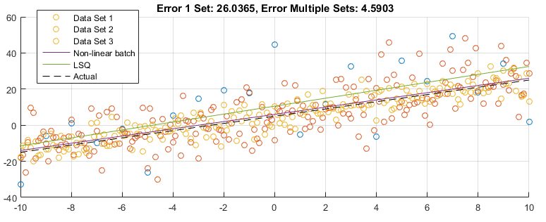

# Nonlinear Least Squares With Multiple Data Sets

<p align='center'>

## Introduction: 

Often one may wish to find optimal parameters given multiple data sets. Depending upon the residual function, one may wish to solve the data sets independently and avoid direct concatenation of the data. Provided one understands non-linear least squares it should be fairly intuitive how one combines multiple data sets. Simply append the residual array with the residual output of each data set. 

Consider a residual function of the following: 

```matlab
function r = rFnc(x,y,theta)
```

In the above function, ***x*** is your input data, ***y*** are your output measurements, and theta are the parameters you wish to optimize. Each of these should be in a column vector form. This residual function can be anything and it is what you are trying to opimize against. For example, one can do an anonomous inline residual function for a line (y= m*x + b) such as the following: 

```matlab
residualFnc = @(x,y,theta) y - (x*theta(2)+theta(1)); % Experimental data minus the equation of a line
```

**Create a batch residual function:** Now consider a function that concatenates the various residual vectors into one larger residual array for multiple datasets: 

```matlab
function r =subR(v,rFnc,theta)
    % Determine size of R Vector
    numElements = 0;
    for i=1:size(v,1) 
        numElements = numElements + length(v{i,2});
    end
    r = zeros(numElements,1);
    j = 0;
    for i = 1:size(v,1) % Compute Residuals and concat 
        r(j+1:j+length(v{i,2}),1) = rFnc(v{i,1},v{i,2},theta);
        j = length(v{i,2});
    end
end
```
**Alter Jacobian:** Next, modify a finite difference Jacobian for the modified residual function.

```matlab
function J=jacB(v,fnc,params)
eps = 1e-8;
x1 = subR(v,fnc,params);
m = length(x1);
n = length(params);
J = zeros(m,n);
for i = 1:n
    paramCpy = params; 
    paramCpy(i)= paramCpy(i) + eps;
    J(:,i) = (subR(v,fnc,paramCpy) - x1)/eps;
end

end
```

**Alter lma Function:** Finally, modify the vanilla Levenberg Marquardt function to use both the modified r & J functions. 

```matlab 
function theta = lmaB(v,fnc,params)

alpha = 1;
theta = params;
oldCost = norm(subR(v,fnc,theta));

for i =1:100;
    r = subR(v,fnc,theta);
    J = jacB(v,fnc,theta);
    p = -pinv(J'*J + alpha*eye(length(params)))*J'*r;
    newCost = norm(subR(v,fnc,theta+p));
    if(newCost<oldCost)
        theta = theta+p;  
         if(abs(newCost - oldCost)<0.0001)
             break;
         end
        oldCost = newCost;
        alpha =0.1*alpha;
    else
        alpha = 10*alpha;
    end
end
end

```

## Line Optimization example with multiple datasets 

**Description:** Consider an example where you with to optimize the offset and slope of a line model from multiple datasets. Now, this is a simple example that doesn't *require* NLSQ but none the less, NLSQ can be used. The following is example code in which 3 lines are simulated with varying levels of noise and `lmaB` is called to find the optimal ***theta*** values given the data. 

<p align='center'>

**Example code:** Note, to get this to run you will have to copy the above code and save the individual functions  `subR.m` , `jacB.m`, and `lmaB.m`.
 
```matlab

% NZ Test lma batch
clc
a=2; % actual slope
b=5; % actual offset 
thetaActual = [b;a];

% Generate sample data 
t = (-10:1:10)'; 
t2 = (-10:0.1:10)';
t3 = (-10:0.1:10)';

y = t.*a+b+randn(length(t),1)*20;
y2 = t2.*a+b+randn(length(t2),1)*10;
y3 = t3.*a+b+randn(length(t3),1)*5;

% Create Residual Function: r(x,y,theta) = y - f(x,theta)
testFnc = @(xx,yy,theta) yy - (xx*theta(2)+theta(1)); 

% Create 'cell' vector of data
v = {t,y;t2,y2;t3,y3};

% Create initial guess 
theta = [0;1];

% Input vector of data, residual function, and initial guess into lmaB
theta = lmaB(v,testFnc,theta);

% For reference, perform linear calculation on 1 dataset 
J  = [t.^0,t.^1];
thetaLinear = pinv((J') * J)*(J')*y;

% Calculate Errors 
rLinear = norm(J*thetaActual - J*thetaLinear);
rNL = norm(J*thetaActual - J*theta);

% Make a pretty plot 
fig1 = figure(1);
clf(fig1)
hold on 
scatter(t,y)
scatter(t2,y2)
scatter(t3,y3)
plot(t,J*theta)
plot(t,J*thetaLinear)
plot(t,J*thetaActual,'--black')
legend('Data Set 1','Data Set 2','Data Set 3','Non-linear batch','LSQ','Actual')
grid on
title(['Error 1 Set: ',num2str(rLinear),', Error Multiple Sets: ',num2str(rNL)])
disp(datetime)

```
As observed and expected, the error is less when multiple data is combined versus a single data set. 
