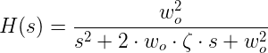
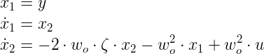
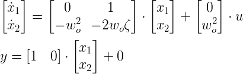
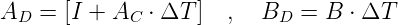

# The Second Order System 

### Transfer Function Form: 

## Converting to State Space:

### State space variable selection: 

With this we can formulate the A,B,C, and D matrices. 

### Discretization of State Space: 

State space systems can easily be discritized with the following: 

Where subscript D states for discrete and where subscript C stands for continuous. 