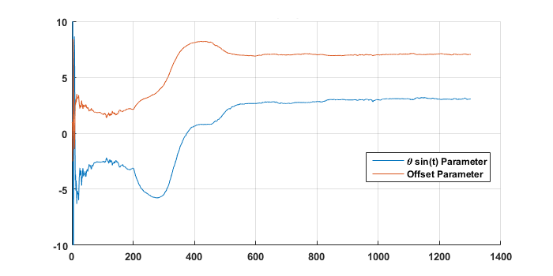
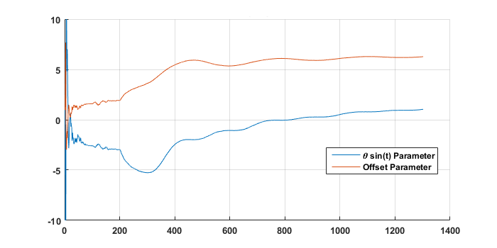

# The Second Order System 

### Transfer Function Form: 

Below are the variables and their respective sizes for Recursive Least Squares (RLS).

<p align="center">

</p>

Where _**n**_ is the number of features / parameters. Notice how _**m**_,traditionally the number of samples, is not used. This is because this algorithm is fed one sample at a time. Below is the equation for RLS. 

<p align="center">

</p>

These 2 equations should be performed every time a new measurement is performed. Below is matlab code to implement this algorithm. 

```

% NZ RLS
function [theta,P] = RLS_Nate(x,y,theta,lambda,P)

P = P/lambda - (P * (x') * x * P)./(lambda + x * P * x')./lambda;
theta = theta + P*(x')*(y - x * theta);

end
```

## Example 1: Identify Quadratic Polynomial using RLS. 

This example shows how with data, one can identify the coefficients of a polynomial using RLS. Note this example doesn't really do RLS justice since such application could be more accurate and easier with Least Squares.

Consider the following polynomial with normally distributed noise:  

<p align="center">

</p>

Here is a plot of the data and the subsequent identified polynomial: 

<p align="center">

</p>

Now as opposed to least squares, the parameters are identified iteratively. This is advantageous to avoid matrix inversion. This also helps provide a more optimal measurement given a single new measurement short of resolving. The following plot shows the parameter convergence: 

<p align="center">

</p>

I have not explained anything in detail yet. Consequently, there are some questions you have hopefully already asked yourself: 

1. What is the forgetting factor(lambda) and what should I set it to?
2. What should I initialize P, the covariance matrix to? What effects does this initialization have? 
3. How does one improve the convergence of the algorithm? 


### The forgetting factor:

The forgetting factor forgets data over time. This factor is ideal for systems that change over time. Consider the following system that changes at time -1 and 0. 

 <p align="center">

</p>

Here are the results with lambda = 0.99

<p align="center">

</p>

Here are the parameters: 

<p align="center">

</p>

However, a system with a lambda of 1 is not designed to change. Consequently, it has extremely slow convergence with a system changes. 

<p align="center">

</p>

However, if not needed, its probably best not to use this parameter for it can be extremely sensitive. For example, here with a lambda of 0.95 the parameters become unstable. 

<p align="center">

</p>

Consequently, this parameter is hard to choose optimally without manually tunning and can potentially be dangerous to stability. Consequently, use the forgetting factor with care. 

## Initializing the Covariance Matrix P

The covariance matrix demonstrates how your samples change with respect to each other. This matrix needs an initial value. Generally the identity matrix times a scalar is chosen. A large scalar allows quick change but produces a lot of initial noise when selecting a parameter. A lower scalar will more gradually move away from an initial guess at the expense of potentially slower convergence. 


## Example 1 Code: 

```

%NZ

x = (-3:0.01:2)'; % This is the time samples 

y = -x.^2 - 1*x + 4 ; % This is the true model
noise = 1*randn(length(x),1); % Noise model 
yMeasured = y + noise; % This is the measurement. 

theta = [1;1;1]; % This is the initial guess 
thetaLong = zeros(3,length(x)+1); % This creates an array of the solution
% per each iteration.
thetaLong(:,1) = theta; % Assign our initial guess 
J = [x.^2,x.^1,x.^0]; % Formulate Jacobian 
P = 1e3 * eye(length(theta)); % Init covarience matrix 
lambda = 1; % No forgetting factor 

for i = 1:length(x)
[thetaLong(:,i+1), P] = RLS_Nate(J(i,:),yMeasured(i),thetaLong(:,i),lambda,P);
end

yCalculated = J*thetaLong(:,end); % Our predicted model

%% Below Code is to make a pretty plot 

fig = figure(1); % Make a figure
clf(fig) % Erase figure
hold on % Hold plot
error = (yMeasured - y).^2; % Error
scatter(x,yMeasured,[],error); % Plot measured data 
plot(x, yCalculated ,'r--','LineWidth',2) % Plot Results
grid on
title('RLS Polynomial:  -x^2 -x + 4 ')
set(gca,'FontSize',10,'FontWeight','bold');
set(gcf,'Units','Pixels');
set(gcf, 'Position', [2500, 500, 700, 350]);

fig3 = figure(3);
clf(fig3);
hold on 
title('RLS Identifying: -x^2 -x + 4')
plot(thetaLong(1,:))
plot(thetaLong(2,:))
plot(thetaLong(3,:))
legend('x^2 Parameter','x Parameter','Offset Parameter')
xlim([0,500])
ylim([-10,10])
grid on
set(gca,'FontSize',10,'FontWeight','bold');
set(gcf,'Units','Pixels');


```