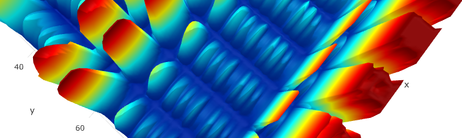

# Nates math tutorials:

The following is my personal reference repository of math examples and concepts that I have found to be useful. The following list introduces various topics as well as provides examples. 

1. [**Least Squares**](Pages/LeastSquares.md)
2. [**Levenberg Marquardt**](Pages/LevenbergMarquardt.ipynb) 
3. [**Kalman Filter**](Pages/KalmanFilter.md)
4. [**Recursive Least Squares**](Pages/RecursiveLeastSquares.md) 
5. [**Gauss Newton**](Pages/GaussNewton.ipynb) 
6. [**Gradient Descent**](Pages/GradientDescent.md) 

