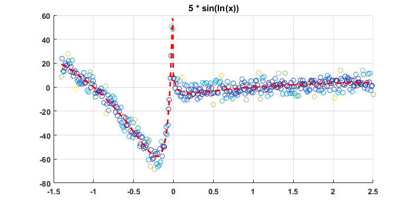

# The not very useful math tutorial

The following is my personal reference repository of math examples and concepts I find to be horrendously useless in industry. Should you have had the misfortune of stumbling upon this page, I recommend you to leave immediately. These concepts I recommend all engineers not to know regardless of engineering discipline. Furthermore, these concepts are probably not appropriate for kids under 18. Read further at your inevitable misfortune. 

## Least Squares: 

Least squares is a method that minimizes the squared error of a linear objective function. This is often used to estimate parameters of a model. 
For example, if we were given data, how do we optimally fit a polynomial to it? More specifically, how does one choose the coefficients of that polynomial?

### Example 1:

Match a polynomial model to the below data:

<p align="center">

</p>

Now in this case, since I generated the data, I know that it is a cubic polynomial. We could fit it perfectly with any polynomial greater than or equal to degree 3. For now, let us consider fitting a 3rd order polynomial to this model. Consequently, our model structure is as follows: 

<p align="center">

</p>

Consequently, we wish to choose the optimal thetas such that our error is minimized. This can be done using the [**normal equation**](https://en.wikipedia.org/wiki/Ordinary_least_squares). The normal equation is as follows: 

<p align="center">

</p>

Where **_theta_** is the vector of our parameters, where **_y_** is our output data, and where **_J_** is the [**Jacobian matrix**](https://en.wikipedia.org/wiki/Jacobian_matrix_and_determinant).

### Understanding the Jacobian

 A Jacobian is a matrix of partial derivatives. While the Jacobian may seem like a complex concept, it is actually relatively simple and understanding it is vital to be able to apply least squares to any linear model. The Jacobian also has applications in [**nonlinear least squares**](https://en.wikipedia.org/wiki/Non-linear_least_squares), the [**extended kalman filter**](https://en.wikipedia.org/wiki/Extended_Kalman_filter) , and many other controls and optimization applications. It also demonstrates whether or not your optimization is [**convex**](https://en.wikipedia.org/wiki/Convex_optimization). If your optimization formulation is non convex, one cannot apply the normal equation. Without the normal equation, solving for optimal coeificents is much more complex. Anyhow, let us look at the Jacobian of our model. What is vital to understand is that for choosing parameters, we take the partial derivative of our model per each parameter. Consequently, the Jacobian we are interested in for this model is as follows:

<p align="center">

</p>

So, what is the partial derivative of our model with respect to **_theta1_** ? Since its with respect to theta1, all other terms drop out and theta1 is multiplied by x^3. A simplier example is what is the derivative of f(x) = 5 * x with respect to x. Clearly it is 5. Like-wise, in this case, the derivative of our model with respect to theta1 is simply x^3. Consequently, for this problem, our Jacobian is as follows:

 <p align="center">

</p>

Now keep in mind, **x** is a **vector**. Which means that **J** is a 2 dimensional  array where we take the partial derivative per sample. If **x** were a variable, the operation we performed above would have been the [**gradient**](https://en.wikipedia.org/wiki/Gradient) as opposed to the Jacobian. So for the above model, the data was for **x = -1.4 to 2.5** in **0.01 increments**. This equates to **_m_** samples being equal to 391. Consequently, our Jacobian is of size **[m,n]** where **m** is the number of samples and **n** is the number of parameters. In this case, **size(J) = [391,4]**. The first 10 rows of J are as follows:

J(1:10 , :) = 


| x^3 | x^2 | x^1 | 1 | 
|----|----|----|----| 
| -2.7440 |    1.9600 |   -1.4000 |    1.0000 |
|   -2.6856 |   1.9321  | -1.3900 |   1.0000
|   -2.6281  |  1.9044  | -1.3800  |  1.0000
|   -2.5714   | 1.8769  | -1.3700  |  1.0000
|  -2.5155    |1.8496   |-1.3600   | 1.0000
|   -2.4604   | 1.8225  | -1.3500  |  1.0000
|   -2.4061   | 1.7956  | -1.3400  |  1.0000
|   -2.3526   | 1.7689  | -1.3300  |  1.0000
|   -2.3000   | 1.7424 |  -1.3200  |  1.0000
|   -2.2481   | 1.7161|   -1.3100  |  1.0000

So the above is simply the first 10 rows. It would have extended for all values in-between -1.4 and 2.5 in 0.01 increments. With this matrix **J** , we can now apply the normal equation and get the optimal parameters. 

### Results of the normal equation:

Using the normal equation, the J formulated above, and the data, we get the optimal parameters for this data. Using this parameters, we can genererate the red line seen below. 

<p align="center">

</p>

The code to generate this plot, calculate the normal equation, ...ect is shown below and is done in matlab / octave. 

```
%NZ
x = (-1.4:0.01:2.5)'; % This is the time samples 
y = 10*x.^3-20*x.^2-10*x+20; % This is the true model
noise = 5*randn(length(x),1); % Noise model 
yMeasured = y + noise; % This is the measurement. 
J = [x.^3,x.^2,x.^1,x.^0]; % Formulate Jacobian 
theta = pinv(J' * J) * J' * yMeasured % Normal Equation
yCalculated = J*theta; % Our predicted model

%% Below code is to make a pretty plot 

fig = figure(1); % Make a figure
clf(fig) % Erase figure
hold on % Hold plot
error = (yMeasured - y).^2; % Error
scatter(x,yMeasured,[],error); % Plot measured data 
plot(x, yCalculated ,'r--','LineWidth',2) % Plot Results
grid on
title('Least Squares')
set(gca,'FontSize',10,'FontWeight','bold');
set(gcf,'Units','Pixels');
set(gcf, 'Position', [500, 500, 700, 350]);
```

### Results: 

So the above code calculated the following for theta: 

<p align="center">

</p>

The true model, as seen from the code, is the following: 

<p align="center">

</p>

Where   represents normally distributed noise with a standard deviation of 5. As seen in the results, the normal equation produced parameters that were near identical to the model. 

## Digging Deeper: 

### Lower order model: 

So how well would least squares have worked if we had attempted to use a quadratic model as opposed to a cubic? 

```
J = [x.^2,x.^1,x.^0]; % Formulate Jacobian 
```

<p align="center">

</p>

As observed above, not very well. This model is too simple and not reflective of our data.

### Higher order model:

How well would a 5th order polynomial model the cubic?

```
J = [x.^5,x.^4,x.^3,x.^2,x.^1,x.^0]; % Formulate Jacobian 
```

<p align="center">

</p>

As observed, it works quite well. This may ''over-fit'' the model though this is a discussion for another time. 

### Identifying parameters for any function:

Can we only model polynomials? No, least squares can identify optimal parameters for **any model as long as that model is linear with respect to the parameters**. Consider the following model: 
<p align="center">

</p>
While this represents a highly nonlinear function, it is actually linear with respect to the model. The Jacobian for this function is simply:

```
J = [sin(log(x))]; % Formulate Jacobian 
```

And using the prior code modified for our new model we get: 

```
x = (-1.4:0.01:2.5)'; % This is the time samples 
y = 5*sin(log(x)); % This is the true model
noise = 5*randn(length(x),1); % Noise model 
yMeasured = y + noise; % This is the measurement. 
J = [sin(log(x))]; % Formulate Jacobian 
theta = pinv(J' * J) * J' * yMeasured % Normal Equation
yCalculated = J*theta; % Our predicted model
```

<p align="center">

</p>

This is trivial for least squares since the parameter we were trying to identify was simply the amplitude of the model, and it just so happens that we knew exactly what the true model was except for the amplitude. In reality, we often do not know or there may not be a true model so we have to create one ourselves. Here is what we get if we attempt to fit a 5th order polynomial to this model. 

<p align="center">

</p>

As observed, the model isn't that great of a fit but one could fix this by increasing the polynomial order. Choosing the proper model for a given data set is often a science in of itself and depends greatly on the application. 

### Jacobians that contain parameters:
You are about to experience the bane of mathematics and optimization. Consider the following simple model of a sine wave:

<p align="center">

</p>

The Jacobian for this is the following: 

<p align="center">

</p>

Notice how this is something that we have not encountered before where thetas(parameters) themselves ended up in the Jacobian. What this means is that this optimization problem is non-linear with respect to the parameters. It also means that this problem is non-convex and cannot be solved with the normal equation. [**Nonlinear least squares**](https://en.wikipedia.org/wiki/Non-linear_least_squares) can be used to arrive at a solution. However, this solution may not be the optimal solution and it requires an initial guess. This initial guess will drastically effect the results and convergence. 

